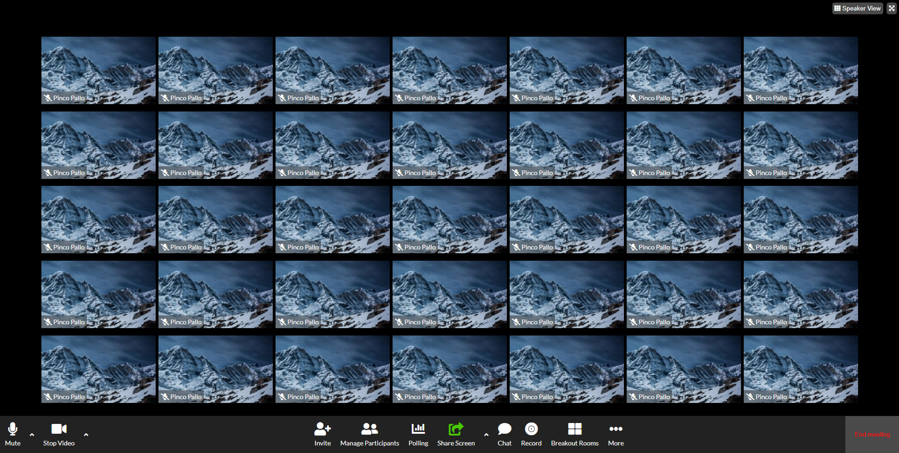

# Esercizio
Zoom

## Descrizione
Riproduciamo il layout come da screenshot (che rimane il nostro riferimento principale).
Analizziamo sempre prima il layout e scriviamo dei commenti per individuare le macroaree.
Facciamo un passo alla volta e puntiamo alla semplicità.

